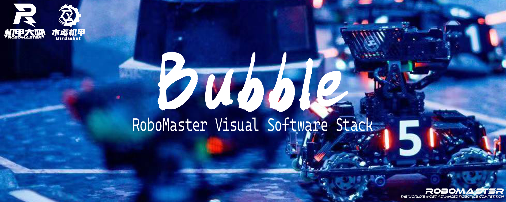

<div align="center">

<div>
    <a href=""></a>
    <a href="https://hub.docker.com/repository/docker/birdiebot/bubble-aarch64v8"></a>
    <a href="https://www.gnu.org/licenses/agpl-3.0.en.html"></a>
    <a href="https://birdiebot.github.io/bubble_documentation/"></a>
</div>
</div>

English | [简体中文](.github/README_zhCN.md)

Bubble is a Mechanical Innovation Base of Shanghai University of Engineering Science and Student Science Technology Innovation Center Birdiebot Team maintains visual algorithm open source software stack. Bubble is developed based on ROS2. Bubble provides a series of tasks related to RMU related visual algorithms.

Bubble documentation is maintained on the [Bubble Documentation Page](https://birdiebot.github.io/bubble_documentation/), where you can find the design and details of Bubble documentation.

# Getting start
For detailed usage and configuration information, see [Getting start](https://birdiebot.github.io/bubble_documentation/%E5%BF%AB%E9%80%9F%E5%BC%80%E5%A7%8B.html)。
## Build Bubble
```bash
# Install vcs tools
sudo apt-get install python3-vcstool
mkdir src

# Load source code
vcs import src < bubble.repos

# Build source code
colcon build --symlink-install
```
## Pre-building Docker Containers
```bash
# Allows external applications to connect to the host's display
xhost +

# Run the Bubble Docker container
docker run -it --rm --net=host --runtime nvidia \
    -e DISPLAY=$DISPLAY -v /tmp/.X11-unix/:/tmp/.X11-unix \
    --device=/dev/bus/usb/ --device=/dev/ttyTHS0 \
    -v /home/nvidia/Desktop/bubble:/home/bubble \
    birdiebot/bubble-aarch64v8:v1.0-l4t-r32.7.1 /bin/bash

# Run project
ros2 launch bubble_bringup infantry_launch.py
```
## Parameter Configuration
```bash
# As infantry example
# More detail see bubble_bringup repo
# Modifying configuration file
gedit ./src/bubble_bringup/config/infantry_param.yaml
gedit ./src/bubble_bringup/launch/infantry_launch.py

# Run project
. install/setup.sh
ros2 launch bubble_bringup infantry_launch.py
```

# Why Bubble
Different parts of the Bubble are maintained in different repos, so you have the flexibility to combine different packages.

[Here](https://birdiebot.github.io/bubble_documentation/getting_started/%E6%A8%A1%E5%9D%97%E8%BF%90%E8%A1%8C%E6%95%88%E6%9E%9C%E5%AE%9E%E4%BE%8B.html) we show what we've achieved so far.

|repos name | link | notes|
|---|---| --- |
|bubble_core|[bubble_core repo](https://github.com/Birdiebot/bubble_core) | Applicable to the RMU communication protocol between MUC and onbord computer, the content of the protocol is maintained in [birdiebot communication protocol manual](https://birdiebot.github.io/bubble_documentation/guide/%E6%9C%A8%E9%B8%A2%E9%80%9A%E8%AE%AF%E5%8D%8F%E8%AE%AE.html) |
|bubble_camera|[bubble_camera repo](https://github.com/Birdiebot/bubble_camera)| ROS packages of different cameras are maintained, where the `main` branch maintains the common USB camera, the `hikrobot_camera` branch maintains the Hikrobot Industrial camera, and the `gxusb_camera` maintains the Daheng Industrial camera |
|bubble_interface|[bubble_interface repo](https://github.com/Birdiebot/bubble_interface)|Bubble features inter-package message type definition by DDS|
|bubble_detector|[bubble_detector repo](https://github.com/Birdiebot/bubble_detector)|Visual recognizer, where `Visual` package uses the traditional visual recognition armor, `visual_SJTU` package is secondary development of Shanghai Jiaotong University sentinel auto-aiming system, using the improved YOLOv5 neural network to recognize the armor, `visual_rune` package to recognize the RMUC2019-2022 power rune|
|bubble_contrib|[bubble_contrib repo](https://github.com/Birdiebot/bubble_contrib)|Achieved the RMU in the various tasks. The `aiming` package maintains aiming (automatic aiming and power rune strikes), and the `decesion` package uses finite state machines (FSM) to control robot execution |
|bubble_resouces|[bubble_resouces repo](https://github.com/Birdiebot/bubble_resources)|ROS Bags for testing and resource files that may be needed in the project|
|bubble_navigation|[bubble_navigation repo](https://github.com/Birdiebot/bubble_navigation)|Robot model transmit related files|
|bubble_bringup|[bubble_bringup repo](https://github.com/Birdiebot/bubble_bringup)|Implement the top-level bringup launch files|

 
# About us
Birdiebot is a school-level science and technology innovation team organized by the office of Academic Affairs in Shanghai University of Engineering Science. With the support of the Mechanics Innovation Base under Student Science and Technology Innovation Center, Birdiebot is committed to carry out science and technology innovation activities in robot competitions, robot ecology, engineering culture and other fields. To cultivate young, outstanding engineers for China’s intelligent manufacturing industry.

## Contributing
We welcome you to join us in the Bubble project to build the RoboMaster visual algorithm software ecosystem. We have some early ideas about the future maintenance of the Bubble project, and you can participate in the maintenance and governance of the Bubble project [here](https://birdiebot.github.io/bubble_documentation/resources/%E7%9B%B8%E5%85%B3%E9%A1%B9%E7%9B%AE.html).

## Contact
You can ask any questions on the Github Issues page or in the RoboMaster forum. For Visual Algorithm communication and Bubble project governance, you can contact us at algorithm@birdiebot.top. We also welcome RoboMaster teams to communicate with us both online and offline. You can contact us at robomaster@birdiebot.top .

# License
Bubble references and other project you can use can be found [here](https://birdiebot.github.io/bubble_documentation/resources/%E7%9B%B8%E5%85%B3%E9%A1%B9%E7%9B%AE.html).

The Bubble project is licensed under the [GNU3.0 License](https://www.gnu.org/licenses/agpl-3.0.en.html).

Copyright of Shanghai University of Engineering Science and Technology Student Science and Technology Center Mechanical Innovation Base Birdiebot Team. All rights reserved.